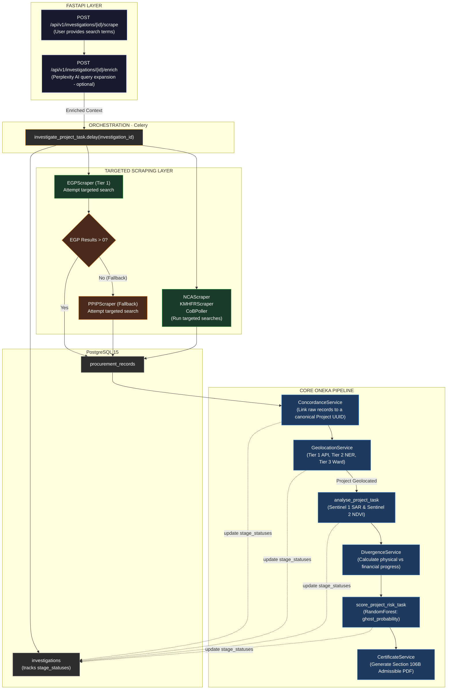

# Oneka AI — Single Project Investigation Flowchart

This diagram outlines the newly added **Single Project Investigation Pipeline**, demonstrating how a targeted investigation flows through the ingestion layer and integrates into the existing end-to-end Oneka AI platform.

## ASCII Flowchart

```text
╔══════════════════════════════════════════════════════════════════════════════════╗
║                    ONEKA AI — SINGLE PROJECT INVESTIGATION FLOW                  ║
║                      Targeted Pipeline & Fallback Logic                          ║
╚══════════════════════════════════════════════════════════════════════════════════╝

┌──────────────────────────── USER TRIGGER (API Layer) ────────────────────────────┐
│                                                                                  │
│       POST /api/v1/investigations/{id}/scrape                                    │
│       (Search terms provided by user)                                            │
│                    │                                                             │
│                    ▼                                                             │
│       POST /api/v1/investigations/{id}/enrich    (Optional)                      │
│       (Perplexity AI query expansion for better scraping context)                │
│                                                                                  │
└────────────────────┬─────────────────────────────────────────────────────────────┘
                     │
                     ▼
┌────────────────── ORCHESTRATION ─────────────────────────────────────────────────┐
│                    │                                                             │
│       investigate_project_task.delay(investigation_id)                           │
│                    │  (Celery worker)                                            │
│                    │                                                             │
│       Updates `investigations` table -> stage_statuses JSON                      │
└────────────────────┬─────────────────────────────────────────────────────────────┘
                     │
                     ▼
┌───────────── TARGETED SCRAPING LAYER (data/scrapers/) ───────────────────────────┐
│                                                                                  │
│                         ┌──────────────────────┐                                 │
│                         │    EGPScraper        │                                 │
│                         │    (Primary Tier 1)  │                                 │
│                         └──────────┬───────────┘                                 │
│                                    │                                             │
│                         ┌──────────▼───────────┐                                 │
│                         │ EGP Results > 0 ?    │                                 │
│                         └──────────┬───────────┘                                 │
│                                    │                                             │
│               ┌──────YES───────────┴───────────NO───────┐                        │
│               │                                         │                        │
│               │                              ┌──────────▼───────────┐            │
│               │                              │    PPIPScraper       │            │
│               │                              │    (Fallback Source) │            │
│               │                              └──────────┬───────────┘            │
│               │                                         │                        │
│               ▼                                         ▼                        │
│       ProcurementRecord                         ProcurementRecord                │
│       source=EGP                                source=PPIP                      │
│                                                                                  │
│  (Concurrently: NCAScraper, KMHFRScraper, CoBPoller run targeted searches)       │
└────────────────────┬─────────────────────────────────────────────────────────────┘
                     │
                     ▼
┌───────── INTEGRATION INTO CORE ONEKA PIPELINE ───────────────────────────────────┐
│                                                                                  │
│  ┌─────────────────────── ConcordanceService ─────────────────────────────-──┐   │
│  │  Links raw records to a canonical Project UUID                            │   │
│  └─────────────────────────────────┬─────────────────────────────────────────┘   │
│                                    │                                             │
│  ┌─────────────────────── GeolocationService ─────────────────────────────-──┐   │
│  │  Tier 1 API, Tier 2 NER, Tier 3 Ward Centroid                             │   │
│  └─────────────────────────────────┬─────────────────────────────────────────┘   │
│                                    │                                             │
│  ┌─────────────────────── Satellite Pipeline ─────────────────────────────-──┐   │
│  │  analyse_project_task (Sentinel-1 SAR, Sentinel-2 NDVI)                   │   │
│  └─────────────────────────────────┬─────────────────────────────────────────┘   │
│                                    │                                             │
│  ┌─────────────────────── Divergence Engine ──────────────────────────────-──┐   │
│  │  compare financial vs physical progress                                   │   │
│  └─────────────────────────────────┬─────────────────────────────────────────┘   │
│                                    │                                             │
│  ┌─────────────────────── ML Engine ──────────────────────────────────────-──┐   │
│  │  score_project_risk_task (ghost_probability)                              │   │
│  └─────────────────────────────────┬─────────────────────────────────────────┘   │
│                                    │                                             │
│  ┌─────────────────────── Certificate Generation ─────────────────────────-──┐   │
│  │  Generate Section 106B Admissible PDF Certificate                         │   │
│  └───────────────────────────────────────────────────────────────────────────┘   │
└──────────────────────────────────────────────────────────────────────────────────┘
```

---

## Mermaid Flowchart



### Key Differences from Bulk Ingestion:
1. **Targeted Entry Point:** Instead of background cron jobs scraping *everything*, a user explicitly requests an investigation via the API with specific search terms.
2. **Context Enrichment:** An optional `enrich` step (using Perplexity AI) expands simple search terms into highly targeted queries before hitting the government portals.
3. **Sequential Fallback Logic:** The `investigate_project_task` implements smart routing. It tries the primary data source (EGP) first. If EGP returns `0` results (perhaps due to site issues or the tender not being listed), it automatically falls back to the historical/backup registry (PPIP).
4. **State Tracking:** The `investigations` table maintains a `stage_statuses` JSON payload, allowing the frontend to poll and display real-time progress across Scraping, Concordance, Geolocation, Satellite, and ML stages.
