# Oneka AI — System Flowchart

**Kenya's Autonomous Infrastructure Audit Platform**  
Both diagrams represent the same end-to-end data flow, from raw government data sources through to the auditor's legal certificate.

---

## ASCII Flowchart

```
╔══════════════════════════════════════════════════════════════════════════════════╗
║                        ONEKA AI — END-TO-END DATA FLOW                           ║
║            Kenya's Autonomous Infrastructure Audit Platform                      ║
╚══════════════════════════════════════════════════════════════════════════════════╝

┌────────────────────────────────── DATA SOURCES ─────────────────────────────-───┐
│                                                                                 │
│  ┌──────────────┐  ┌──────────────┐  ┌──────────┐  ┌───────── ─┐  ┌───────--──┐ │
│  │   e-GP Kenya │  │     PPIP     │  │  COB     │  │  KMHFR    │  │   NCA     │ │
│  │  (primary)   │  │ (historical  │  │  BIRR    │  │ Facility  │  │ Contractor│ │
│  │  tenders +   │  │  archive,    │  │  PDFs    │  │ Registry  │  │ Registry  │ │
│  │  GPS coords  │  │  run once)   │  │          │  │  5,000+   │  │           │ │
│  └──────┬───────┘  └──────┬───────┘  └────┬─────┘  └───-─┬─────┘  └────┬───--─┘ │
└─────────┼─────────────────┼───────────────┼──────────────┼──────────────┼────-──┘
          │                 │               │              │              │
          │   Playwright + httpx async scrapers (data/scrapers/)          │
          ▼                 ▼               ▼              ▼              ▼

┌──────────────────────────── INGESTION & PARSING ───────────────────────────────┐
│                                                                                │
│  ProcurementRecord     ProcurementRecord    CoBParser       GeolocationRecord  │
│  source=eGP            source=PPIP          (pdfplumber)    source=KMHFR       │
│  delivery_lat/lon      is_historical=True   ─────────────►  ~5,000 facilities  │
│  gps_quality_score     (backfill only)      FinancialRecord                    │
│                                             absorption_rate                    │
│                                                                                │
│                   All writes via Celery tasks → PostgreSQL 15 + PostGIS 3.4    │
└────────────────────────────────────┬───────────────────────────────────────────┘
                                     │
                                     ▼

┌─────────────────────────── INTEROPERABILITY ENGINE ────────────────────────────┐
│                                                                                │
│  ┌─────────────────────── ConcordanceService ───────────────────────────-──┐   │
│  │  Assigns project_uuid · Links procurement → financial → geolocation     │   │
│  │  Deduplicates via RapidFuzz (score > 85 = same project)                 │   │
│  └─────────────────────────────────┬───────────────────────────────────────┘   │
│                                    │                                           │
│       ┌────────────────────────────┼──────────────────────────┐                │
│       │                            │                          │                │
│  ┌────▼──────────────┐  ┌──────────▼────────────┐  ┌─────────▼───────────┐     │
│  │  TIER 1           │  │  TIER 2               │  │  TIER 3             │     │
│  │  e-GP GPS         │  │  spaCy NER +          │  │  Ward Centroid      │     │
│  │  (direct embed)   │  │  RapidFuzz            │  │  Fallback           │     │
│  │                   │  │  KMHFR / NEMIS        │  │  (UNOCHA Level 3)   │     │
│  │  coverage: 70–85% │  │  score ≥ 90 → accept  │  │  always produces    │     │
│  │  quality: 70–90   │  │  score 70–89 → review │  │  a coordinate       │     │
│  │  skip NER step    │  │  quality: 60–80       │  │  quality: 20        │     │
│  └────────┬──────────┘  └───────────┬───────────┘  └────────────┬────────┘     │
│           └────────────────────┬────┘                           │              │
│                                └────────────────────────────────┘              │
│                                         │                                      │
│                                GPS stored in geolocation_records               │
└─────────────────────────────────────────┬──────────────────────────────────────┘
                                          │
                   ┌──────────────────────┴───────────────────────┐
                   │                                              │
                   ▼                                              ▼

┌──────── SATELLITE PIPELINE ────────────┐  ┌──────── FINANCIAL PIPELINE ────────┐
│                                        │  │                                    │
│  GPS coords → 500m AOI bounding box    │  │  COB BIRR PDF → CoBParser          │
│         │                              │  │         │                          │
│         ▼                              │  │         ▼                          │
│  Copernicus Data Space API             │  │  FinancialRecord                   │
│  (sentinelsat)                         │  │  .vote_head                        │
│         │                              │  │  .budget_allocated_kes             │
│         ├── Sentinel-2 L2A (10m)       │  │  .budget_absorbed_kes              │
│         │   max_cloud_cover = 20%      │  │  .absorption_rate (0–100%)         │
│         │        │                     │  │         │                          │
│         │        ▼                     │  │         ▼                          │
│         │   NDWIProcessor              │  │   financial_progress = absorption  │
│         │   (B03, B08)                 │  │                                    │
│         │   water_present?             │  └────────────────┬───────────────────┘
│         │   YES → skip, log            │                   │
│         │   NO  ↓                      │                   │
│         │                              │                   │
│         │   NDVIProcessor (Satpy)      │                   │
│         │   B04, B08 → NDVI            │                   │
│         │   ndvi_mean, ndvi_slope      │                   │
│         │                              │                   │
│         └── Sentinel-1 GRD (10m)       │                   │
│             SARProcessor (PyroSAR)     │                   │
│             VV/VH backscatter (dB)     │                   │
│             sar_vv_mean                │                   │
│                   │                    │                   │
│                   ▼                    │                   │
│         satellite_analyses table       │                   │
│                   │                    │                   │
│                   ▼                    │                   │
│         GeoTIFF → Web Mercator         │                   │
│         XYZ tile pyramid → S3          │                   │
└──────────────────┬─────────────────────┘                   │
                   │                                         │
                   └─────────────────────┬───────────────────┘
                                         │
                                         ▼

┌────────────────────────── DIVERGENCE ENGINE ───────────────────────────────────┐
│                                                                                │
│  physical_progress    = f(ndvi_slope, sar_backscatter_delta)  [0–100]          │
│  financial_progress   = absorption_rate from FinancialRecord  [0–100]          │
│                                                                                │
│  divergence_score  =  financial_progress  −  physical_progress                 │
│                                                                                │
│  ┌─────────────────────────────────────────────────────────────────────────┐   │
│  │  score > 50   →  ████ RED    — ghost project suspected                  │   │
│  │  score 20–50  →  ████ YELLOW — stalled / underspend detected            │   │
│  │  score < 20   →  ████ GREEN  — progressing on track                     │   │
│  └─────────────────────────────────────────────────────────────────────────┘   │
└────────────────────────────────────────┬───────────────────────────────────────┘
                                         │
                                         ▼

┌────────────────────────────── ML ENGINE ──────────────────────────────────────┐
│                                                                               │
│  FeatureEngineer extracts 10 features per project:                            │
│  ndvi_slope · sar_backscatter_delta · divergence_score · months_to_clearing   │
│  absorption_anomaly · contract_value_log · project_type_encoded               │
│  county_cloud_risk · contractor_tier · phase_on_schedule                      │
│                         │                                                     │
│                         ▼                                                     │
│           RandomForestClassifier (ghost_detector_v1.pkl)                      │
│           trained on 30 historical projects                                   │
│           5-fold StratifiedKFold CV · target AUC ≥ 0.80                       │
│           SMOTE oversampling (10 ghost : 20 successful in training set)       │
│                         │                                                     │
│                         ▼                                                     │
│                ghost_probability  (0.0 – 1.0)                                 │
│                         │                                                     │
│       ┌─────────────────┼──────────────────────┐                              │
│       │                 │                      │                              │
│   0–30% LOW         31–60% MEDIUM         61–80% HIGH    81–100% CRITICAL     │
│   (green)           (yellow)              (orange)       (red)                │
│                         │                                                     │
│                         ▼                                                     │
│              Project.risk_level updated in DB                                 │
└────────────────────────────────────────┬──────────────────────────────────────┘
                                         │
                                         ▼

┌────────────────────────── FASTAPI LAYER (/api/v1) ─────────────────────────────┐
│                                                                                │
│  /projects          /procurement       /financial       /geolocation           │
│  /satellite         /risk              /certificates    /maps                  │
│                                                                                │
│  ┌─────────────────────── Security Controls ───────────────────────────────┐   │
│  │  Google Maps API key   → server-side session token proxy                │   │
│  │  Rate limiting         → slowapi + Redis                                │   │
│  │  S3 presigned URLs     → 60-minute expiry                               │   │
│  │  CSP / X-Content-Type  → CORS middleware headers                        │   │
│  └─────────────────────────────────────────────────────────────────────────┘   │
└──────────────┬──────────────────────────────────────────────┬────────────────-─┘
               │                                              │
               ▼                                              ▼

┌──────────── DASHBOARD ─────────────────┐  ┌───── SECTION 106B CERTIFICATE ─────┐
│                                        │  │   (Kenya Evidence Act, 2023)       │
│  Next.js 16 + CesiumJS                 │  │                                    │
│  Google Photorealistic 3D Tiles        │  │  • ESA Copernicus data source      │
│  (API key proxied server-side)         │  │  • Scene acquisition timestamp     │
│                                        │  │  • NDVI / SAR algorithm desc.      │
│  Overlay layers from S3 XYZ tiles:     │  │  • SHA-256 scene integrity hash    │
│  · NDVI heatmap (green–brown)          │  │  • Chain of custody log            │
│  · SAR change detection (greyscale)    │  │  • "System was operating properly" │
│                                        │  │  • Signature block (OAG/EACC)      │
│  Views:                                │  │                                    │
│  · Risk heat map (GeoJSON pins)        │  │  Generated as PDF                  │
│  · Truth-record project card           │  │  WeasyPrint + Jinja2 template      │
│  · Divergence timeline chart           │  │  Stored → S3                       │
│  · Alert feed (CRITICAL / HIGH)        │  │  Endpoint: GET /certificates/{id}  │
│                                        │  │                                    │
│  Primary user:   Kenya OAG             │  │  Admissible as digital evidence    │
│  Secondary:      EACC, PPIU            │  │  in Kenyan courts                  │
└────────────────────────────────────────┘  └────────────────────────────────────┘
```

---

## Mermaid Flowchart

```mermaid
flowchart TD
    %% ── DATA SOURCES ──────────────────────────────────────────────────────────
    subgraph SOURCES["DATA SOURCES"]
        EGP["🏛️ e-GP Kenya\n(primary — mandatory GPS\nsince July 2025)"]
        PPIP["📋 PPIP Archive\n(one-time historical\nimport only)"]
        COB["📊 COB BIRR PDFs\n(quarterly expenditure\nreports)"]
        KMHFR["🏥 KMHFR API\n(5,000+ facility\nGPS registry)"]
        NCA["🏗️ NCA Registry\n(contractor licenses\n& project status)"]
    end

    %% ── INGESTION ─────────────────────────────────────────────────────────────
    subgraph INGEST["INGESTION LAYER  ·  data/scrapers/  ·  Celery tasks"]
        S_EGP["EGPScraper\nPlaywright + response intercept\n→ ProcurementRecord\n+ GeolocationRecord (GPS tier 1)"]
        S_PPIP["PPIPScraper\nPlaywright / httpx\n→ ProcurementRecord\nis_historical=True"]
        S_COB["CoBPoller\nPlaywright → PDF download\n+ CoBParser (pdfplumber)\n→ FinancialRecord"]
        S_KMHFR["KMHFRScraper\nPlaywright → paginated API\n→ GeolocationRecord\nsource=KMHFR"]
        S_NCA["NCAScraper\nPlaywright\n→ ProcurementRecord\ncontractor_nca_license"]
    end

    EGP   --> S_EGP
    PPIP  --> S_PPIP
    COB   --> S_COB
    KMHFR --> S_KMHFR
    NCA   --> S_NCA

    %% ── DATABASE ──────────────────────────────────────────────────────────────
    subgraph DB["PostgreSQL 15 + PostGIS 3.4 · AWS S3"]
        T_PROC["procurement_records\negp_tender_id\ndelivery_lat/lon\ngps_quality_score\ngps_source"]
        T_FIN["financial_records\nvote_head · fiscal_year\nbudget_allocated/absorbed\nabsorption_rate"]
        T_GEO["geolocation_records\nPostGIS Point (EPSG:4326)\nmatch_confidence\nsource_system"]
        T_SAT["satellite_analyses\nndvi_mean · sar_vv_mean\nchange_detected\ntile_url"]
        T_PROJ["projects\nproject_uuid (PK)\nproject_name · county\nrisk_level enum\nghost_probability"]
        S3["☁️ AWS S3\nPDFs · satellite GeoTIFFs\nXYZ map tiles\nSection 106B certificates"]
    end

    S_EGP   --> T_PROC
    S_PPIP  --> T_PROC
    S_COB   --> T_FIN
    S_KMHFR --> T_GEO
    S_NCA   --> T_PROC

    %% ── INTEROPERABILITY ENGINE ───────────────────────────────────────────────
    subgraph INTEROP["INTEROPERABILITY ENGINE  ·  backend/src/services/"]
        CONC["ConcordanceService\nFuzzy-match procurement titles\nagainst existing Projects\nscore > 85 → same project_uuid\nassign project_type, county, status"]

        subgraph GEO_TIERS["Three-Tier Geolocation"]
            T1["Tier 1 — e-GP GPS\ngps_source=EGP_MANUAL_PIN\nquality: 70–90\ncoverage: 70–85%\n(skip NER — coords already set)"]
            T2["Tier 2 — spaCy NER + RapidFuzz\nExtract FAC/GPE/LOC entities\nMatch against KMHFR + NEMIS cache\nscore ≥ 90 → auto-accept (q=80)\nscore 70–89 → flag review (q=60)"]
            T3["Tier 3 — Ward Centroid\nUNOCHA Kenya L3 admin boundaries\nlowest precision\nalways produces a coordinate (q=20)"]
        end

        FIN_SVC["FinancialService\ningest_cob_report()\ncalculate_absorption_gap()\nfinancial_progress = absorption_rate"]
    end

    T_PROC --> CONC
    T_FIN  --> CONC
    T_GEO  --> CONC
    CONC   --> T1
    T1     -- "no GPS set" --> T2
    T2     -- "score < 70" --> T3
    T1 & T2 & T3 --> T_GEO
    CONC   --> T_PROJ
    T_FIN  --> FIN_SVC

    %% ── SATELLITE PIPELINE ────────────────────────────────────────────────────
    subgraph SAT_PIPE["SATELLITE PIPELINE  ·  satellite/src/ + Celery"]
        COP["Copernicus Data Space API\nsentinelsat\n(GPS → 500m AOI bounding box)"]
        S2["Sentinel-2 L2A\n10m optical\nmax_cloud_cover = 20%"]
        S1["Sentinel-1 GRD\n10m SAR\nVV + VH polarisation"]
        NDWI["NDWIProcessor\nB03 / B08\nwater_present > 0.3 → SKIP\n(flood false-positive filter)"]
        NDVI["NDVIProcessor (Satpy)\nB04 / B08\nndvi_mean · ndvi_slope\nGeoTIFF export"]
        SAR["SARProcessor (PyroSAR + SNAP)\nradiometric calibration\nterrain correction\nsar_vv_mean (dB)"]
        TILES["TileGenerator\nGeoTIFF → EPSG:3857\nXYZ tile pyramid\ngdal2tiles → S3"]
    end

    T_GEO --> COP
    COP --> S2 & S1
    S2  --> NDWI
    NDWI -- "water_present = False" --> NDVI
    NDWI -- "water_present = True"  --> SKIP["⚠️ Skip NDVI\nlog: seasonal water body"]
    S1  --> SAR
    NDVI --> T_SAT
    SAR  --> T_SAT
    T_SAT --> TILES
    TILES --> S3

    %% ── DIVERGENCE ENGINE ─────────────────────────────────────────────────────
    subgraph DIV["DIVERGENCE ENGINE  ·  DivergenceService"]
        DIV_CALC["divergence_score\n= financial_progress − physical_progress\n\nphysical_progress: f(ndvi_slope, sar_delta)\nfinancial_progress: absorption_rate"]
        RED["🔴 RED\ndivergence > 50\nGhost project suspected"]
        YEL["🟡 YELLOW\ndivergence 20–50\nStalled / underspend"]
        GRN["🟢 GREEN\ndivergence < 20\nOn track"]
    end

    T_SAT    --> DIV_CALC
    FIN_SVC  --> DIV_CALC
    DIV_CALC --> RED & YEL & GRN
    RED & YEL & GRN --> T_PROJ

    %% ── ML ENGINE ─────────────────────────────────────────────────────────────
    subgraph ML["ML ENGINE  ·  satellite/src/ + backend/src/services/"]
        FEAT["FeatureEngineer\n10 features:\nndvi_slope · sar_delta · divergence_score\nmonths_to_clearing · absorption_anomaly\ncontract_value_log · project_type_encoded\ncounty_cloud_risk · contractor_tier\nphase_on_schedule"]
        RF["RandomForestClassifier\nghost_detector_v1.pkl\n200 estimators · depth 8\nSMOTE oversampling\n5-fold CV · AUC ≥ 0.80"]
        RISK["ghost_probability: 0.0 – 1.0\n0–30% → LOW  · 31–60% → MEDIUM\n61–80% → HIGH · 81–100% → CRITICAL"]
    end

    T_SAT  --> FEAT
    T_FIN  --> FEAT
    T_PROJ --> FEAT
    FEAT   --> RF
    RF     --> RISK
    RISK   --> T_PROJ

    %% ── FASTAPI ───────────────────────────────────────────────────────────────
    subgraph API["FASTAPI LAYER  ·  backend/src/routers/  ·  /api/v1"]
        R_PROJ["GET/POST /projects\n/projects/{id}/truth-record\n/projects/geojson\n/projects/reconcile"]
        R_SAT["POST /satellite/analyse/{id}\nGET  /satellite/status/{task_id}\nGET  /satellite/tiles/…"]
        R_RISK["GET /risk/score/{id}\nGET /risk/heat-map (GeoJSON)"]
        R_MAP["POST /maps/tiles/session\nGET  /maps/tiles/{token}/{z}/{x}/{y}\n(Google API key proxied server-side)"]
        R_CERT["GET /certificates/{id}\n?analyst_name=…&analyst_title=…\n→ Section 106B PDF download"]
        R_DIV["GET /projects/{id}/divergence\nGET /dashboard/heat-map"]
    end

    T_PROJ --> R_PROJ
    T_SAT  --> R_SAT
    T_PROJ --> R_RISK
    S3     --> R_SAT
    R_PROJ --> R_DIV

    %% ── OUTPUTS ───────────────────────────────────────────────────────────────
    subgraph OUT["OUTPUTS"]
        DASH["📊 Dashboard\nNext.js 16 + CesiumJS\nGoogle Photorealistic 3D Tiles\nNDVI / SAR overlay tiles\nRisk heat map pins\nDivergence timeline chart\nAlert feed\n\nUsers: Kenya OAG · EACC · PPIU"]
        CERT_OUT["📄 Section 106B Certificate\nKenyan Evidence Act\n\n• Copernicus data source\n• Scene timestamp (ISO 8601)\n• SHA-256 integrity hash\n• Chain of custody\n• Processing algorithm\n• Signature block\nAdmissible in court"]
    end

    R_PROJ & R_SAT & R_RISK & R_MAP & R_DIV --> DASH
    R_CERT --> CERT_OUT
    S3     --> CERT_OUT

    %% ── STYLES ────────────────────────────────────────────────────────────────
    classDef source    fill:#1e3a5f,stroke:#4a90d9,color:#fff
    classDef scraper   fill:#1a3a2a,stroke:#4caf50,color:#fff
    classDef db        fill:#2d2d2d,stroke:#888,color:#fff
    classDef engine    fill:#3a2a1a,stroke:#ff9800,color:#fff
    classDef satellite fill:#1a2a3a,stroke:#64b5f6,color:#fff
    classDef ml        fill:#2a1a3a,stroke:#ce93d8,color:#fff
    classDef api       fill:#1a1a2e,stroke:#7986cb,color:#fff
    classDef output    fill:#1a1a1a,stroke:#aaa,color:#fff
    classDef risk_red  fill:#7f1d1d,stroke:#ef4444,color:#fff
    classDef risk_yel  fill:#713f12,stroke:#f59e0b,color:#fff
    classDef risk_grn  fill:#14532d,stroke:#22c55e,color:#fff

    class EGP,PPIP,COB,KMHFR,NCA source
    class S_EGP,S_PPIP,S_COB,S_KMHFR,S_NCA scraper
    class T_PROC,T_FIN,T_GEO,T_SAT,T_PROJ,S3 db
    class CONC,T1,T2,T3,FIN_SVC,GEO_TIERS engine
    class COP,S2,S1,NDWI,NDVI,SAR,TILES satellite
    class FEAT,RF,RISK ml
    class R_PROJ,R_SAT,R_RISK,R_MAP,R_CERT,R_DIV api
    class DASH,CERT_OUT output
    class RED risk_red
    class YEL risk_yel
    class GRN risk_grn
```


